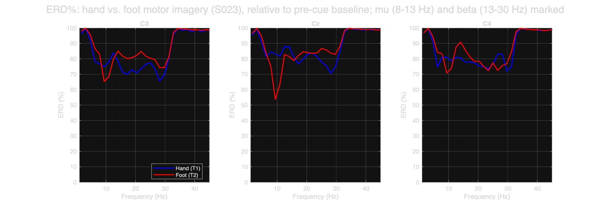
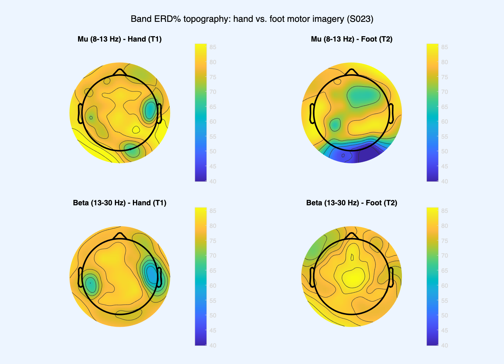
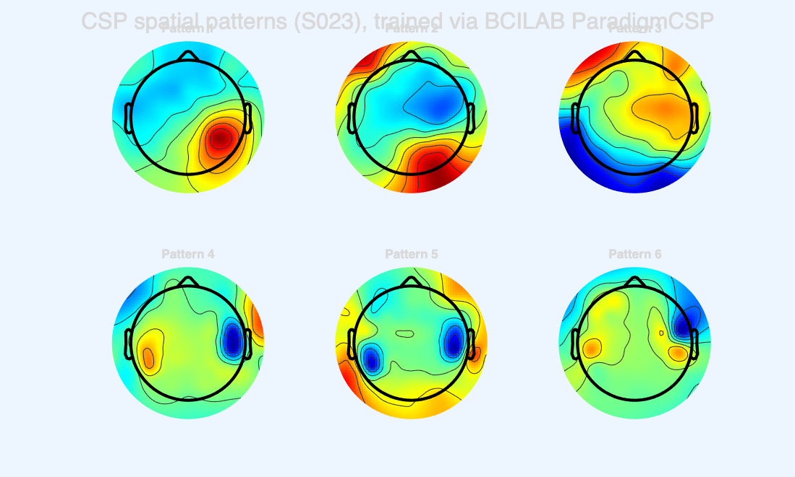

# 🧠 BCI4NAT Seminar Report

A BCI4NAT (Brain-Computer Interfaces for Neurotechnology) seminar project for BTU Cottbus-Senftenberg, Summer Semester 2026. This repo contains the full analysis pipeline and report for classifying imagined hand vs. foot movement from EEG, subject S023.

## 📋 The task

- Take raw EEG recordings of a subject performing imagined hand and foot movement.
- Preprocess the signal in EEGLAB: re-reference, filter, run ICA to remove artifacts, epoch the data around each cue.
- Classify the two conditions (hand vs. foot) in BCILAB using a feature extraction method and a machine learning classifier, evaluated with cross-validation.
- Visualize and interpret both the EEG signal itself (does the expected brain pattern show up?) and what the trained classifier is relying on.

Only EEGLAB and BCILAB functions are used for signal processing and classification, no other MATLAB toolboxes.

## 📁 Dataset

- **Source**: PhysioNet EEG Motor Movement/Imagery Dataset (Schalk, McFarland, Hinterberger, Birbaumer & Wolpaw, 2004), also mirrored on [NEMAR](https://nemar.org/dataset/on004362).
- **Subject**: S023.
- **Task**: Task 4 in the original protocol, imagined hand (both fists) vs. imagined foot movement, cued by a target appearing at the top or bottom of a screen.
- **Recording**: 64-channel EEG, international 10-10 system, BCI2000 acquisition system, 160 Hz sampling rate.
- **Event markers**: `T0` = rest, `T1` = hand imagery onset, `T2` = foot imagery onset.
- **File**: `S023_hand_vs_foot.set` / `.fdt` (EEGLAB format).

## 🛠️ Approach and what the code does

### 1. Preprocessing (`Submission/Code/eeglab_preprocess_S023.m`)

- Loads the raw dataset into EEGLAB.
- Re-references to the average of all 64 channels.
- Applies a zero-phase FIR band-pass filter, 7 to 30 Hz, to keep the mu and beta rhythms relevant to motor imagery while removing slow drift and high-frequency noise.
- Applies a 50 Hz notch filter to remove line noise.
- Resamples to 100 Hz.
- Runs ICA (extended infomax algorithm) on the continuous, filtered data to separate brain sources from artifacts.
- Inspects each component's scalp topography, activity time course, and power spectrum.
- Removes two components (IC6, IC15) whose topography is small and sharply focal over the left temporal area, and whose time course shows sharp, spike-like transients, both signs of muscle artifact rather than brain signal.
- Keeps two components (IC1, IC4) with smooth, broad topographies in posterior and sensorimotor regions and oscillatory (not spike-like) time courses, consistent with genuine brain activity.
- Saves the cleaned continuous dataset (before epoching), which is the version required for the submission.
- Epochs the cleaned data from −0.5 s to 3.5 s around each cue and baseline-corrects against the −500 to 0 ms window, saving a separate epoched dataset for analysis.

### 2. Classification (`Submission/Code/bcilab_pipeline_S023.m`)

- Loads the cleaned continuous dataset into BCILAB.
- Runs BCILAB's `ParadigmCSP` (Common Spatial Patterns), extracting 3 pattern pairs (6 spatial filters).
- Trains a Linear Discriminant Analysis (LDA) classifier on the resulting log-variance features via `ml_trainlda`.
- Evaluates with `bci_train` using 5-fold cross-validation.
- Builds a pooled confusion matrix from every fold's actual per-trial predictions, not just averaged rates.
- Plots the six learned CSP spatial patterns directly from the trained model.
- Saves per-fold metrics and the confusion matrix to CSV.

### 3. Comparison figures (`Submission/Code/eeg_comparison_figures_S023.m`)

- Loads the cleaned, epoched dataset.
- Computes event-related desynchronisation (ERD%), the percentage drop in power during imagery relative to a pre-cue baseline, separately for hand and foot trials.
- Plots ERD% at three sensorimotor electrodes (C3, Cz, C4) across frequency, comparing hand vs. foot.
- Plots ERD% as scalp topographies for the mu (8 to 13 Hz) and beta (13 to 30 Hz) bands, comparing hand vs. foot.

### How to reproduce this

- Open MATLAB with EEGLAB and BCILAB on the path.
- Run `eeglab_preprocess_S023.m` first (produces the cleaned datasets).
- Run `bcilab_pipeline_S023.m` next (produces the classification result and CSP figure).
- Run `eeg_comparison_figures_S023.m` last (produces the ERD comparison figures).
- Each script has a `projectroot` path variable at the top marked `% <-- EDIT`, set it to wherever this repo lives locally.

## 📊 Results

### Classification accuracy: why 73.33%

- **Overall accuracy: 73.33%** (5-fold cross-validation, mean misclassification rate 0.267) against a theoretical chance level of **51.11%** (the proportion of the larger class, 23 hand vs. 22 foot trials out of 45 total). This is clearly above chance.
- Chance level is not 50% here because the classes are not perfectly balanced (23 vs. 22), so always guessing the larger class (hand) would already be right 51.11% of the time. 73.33% beats that baseline by over 22 percentage points.

**Pooled confusion matrix** (all 45 trials, one prediction per trial from its held-out fold):

| | Predicted Hand | Predicted Foot |
|---|---|---|
| **Actual Hand** (23 trials) | 15 | 8 |
| **Actual Foot** (22 trials) | 4 | 18 |

- Hand imagery: 15/23 correctly classified (**65.2%**), 8/23 misclassified as foot.
- Foot imagery: 18/22 correctly classified (**81.8%**), 4/22 misclassified as hand.
- The classifier is noticeably better at recognizing foot imagery than hand imagery. This asymmetry comes directly from the confusion matrix above, not from an assumption.

**Per-fold breakdown** (5-fold cross-validation, from `Submission/Results&Figures/result_bcilab.csv`):

| Fold | Foot correct | Hand correct | Misclassification rate |
|---|---|---|---|
| 1 | 100.0% | 60.0% | 0.222 |
| 2 | 75.0% | 60.0% | 0.333 |
| 3 | 100.0% | 80.0% | 0.111 |
| 4 | 75.0% | 80.0% | 0.222 |
| 5 | 66.7% | 33.3% | 0.444 |

- Accuracy varies a fair amount fold to fold (misclassification rate from 0.111 to 0.444). With only 45 trials, each fold has roughly 9 test trials, so a single wrong prediction shifts a fold's error rate by more than 10 percentage points. Fold 5 is the weakest, both classes did worse there.
- The classifier's strength on foot imagery holds up across most folds (100%, 75%, 100%, 75%), except fold 5. Hand imagery is more consistently weaker (60%, 60%, 80%, 80%, 33%).

### EEG signal: does the expected pattern show up?



*Figure: ERD% (percent power drop relative to a 0.5 s pre-cue baseline) at electrodes C3, Cz, and C4, for hand (blue) vs. foot (red) motor imagery, subject S023. Dotted lines mark the mu (8 to 13 Hz) and beta (13 to 30 Hz) band edges.*

- The clearest difference between conditions is at **Cz**, in the mu band: foot imagery drops to around **54% ERD**, hand imagery only to around **78% ERD**. That is a real, visible gap in the plot above.
- C3 and C4 show a smaller, noisier version of the same pattern, with neither condition consistently stronger.
- This matches the expected layout of motor cortex: the leg/foot representation sits medially (near Cz), the hand representation sits more laterally (near C3/C4), so a stronger foot-related signal at the midline electrode is exactly what somatotopic organisation would predict.



*Figure: Scalp topography of mu-band (8 to 13 Hz) and beta-band (13 to 30 Hz) ERD%, hand vs. foot motor imagery, subject S023. Warmer colors indicate a larger power drop from baseline.*

- The mu-band maps (top row) show a visibly different pattern at the frontal midline region between hand and foot, consistent with the electrode-level Cz result above.
- The color scale here compresses a fairly narrow range of ERD values, so the topography maps look less dramatic than the C3/Cz/C4 curves suggest, that is a visualization effect, not a contradiction.

### CSP spatial patterns: what the classifier is relying on



*Figure: The six CSP spatial patterns (3 pattern pairs) learned by the trained BCILAB model, subject S023. Each scalp map shows how strongly that pattern weights each electrode; red and blue mark opposite-signed weights.*

- Most patterns are focal rather than spread diffusely across the whole scalp. Patterns 1, 2, and 5 show tight, localized weighting (temporal and bilateral fronto-central regions), which is a reasonable sign the classifier is picking up on localized brain activity, not a global artifact such as a reference shift or slow drift.
- Patterns 3, 4, and 6 are more bilateral or spread across a wider region, which is less textbook but not unexpected: with only 45 trials, some patterns likely reflect whatever happened to separate the two classes best in this particular sample, rather than picking out only the "true" motor-cortex signal.
- Not every pattern lines up neatly with the classic C3/Cz/C4 sensorimotor sites a larger, cleaner dataset would be expected to show more clearly.

### What to trust, and what not to over-read

- A second, independent CSP+LDA implementation was written directly in MATLAB (not through BCILAB) as a cross-check on the same cleaned data. It reached a noticeably higher accuracy (around 87%). The gap was traced to a real, understood difference in how the two implementations estimate class covariance matrices (BCILAB pools all trials of a class before computing one covariance matrix, the manual version averages a covariance per trial), not a bug in either one. The BCILAB result (73.33%) is the one that matters here, since that is the required toolbox, but the gap itself shows that "the accuracy" of a small-dataset BCI pipeline depends on implementation choices, not just the data.
- The absolute ERD% values reported are higher than typical published figures for this kind of task. This was traced to a short 0.5 s pre-cue baseline window, which makes the baseline power estimate noisier and biased upward. The relative difference between hand and foot conditions is still trustworthy (the same bias affects both), but the specific percentages should not be read as directly comparable to studies using longer baseline windows.
- This is a single-subject result. Nothing here says how well the same pipeline would generalize to a different person.

## 📁 Project structure

```
BCI/
├── README.md
├── Guide/                      Assignment instructions and reference guides
├── Dataset/                    Raw and intermediate EEG data
├── Code/                       All MATLAB scripts, including a manual cross-check
├── Results&Figures/            Full set of generated figures and result files
├── Report/                     Reference material
├── Report_New/                 LaTeX source for the report
└── Submission/                 Everything needed to reproduce the result end to end
    ├── Code/                   EEGLAB/BCILAB scripts (see above)
    ├── Report/                 Compiled report PDF and cleaned pre-epoch dataset
    └── Results&Figures/        Figures and metrics referenced in the report
```

Only `README.md` and `Submission/` are tracked in this repository. Everything else stays local.
